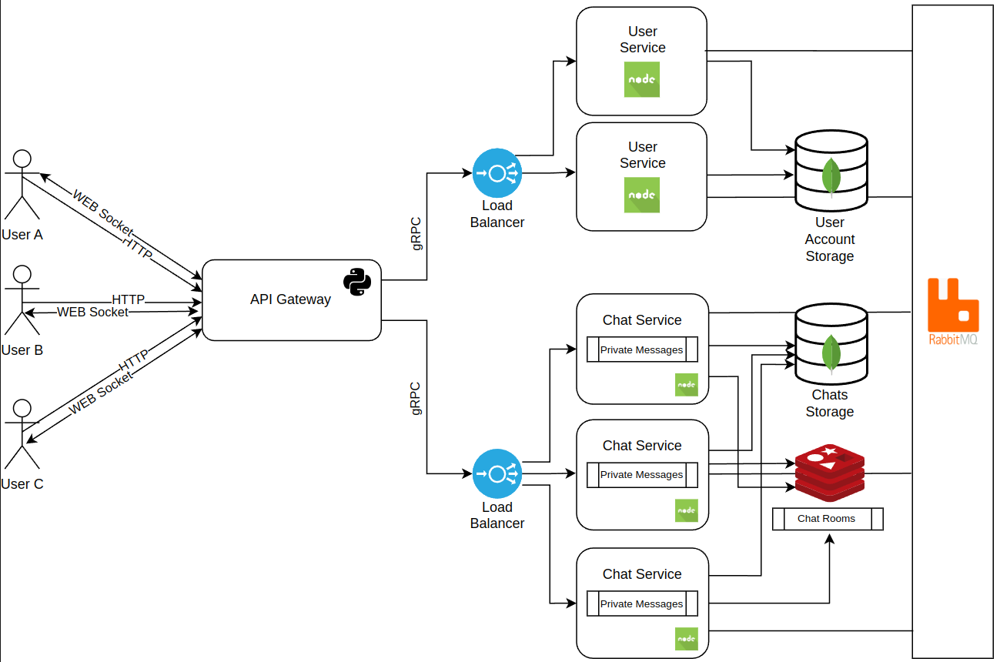

# ChatterRoom

## Description

ChatterRoom is a realtime chat platform, build with a high emphasis on microservices architecture. It has two main functionalities: private chats and group chats.

## Application Suitability

Chat applications require a high level of responsiveness and low latency. This makes them a good candidate for microservices architecture. The microservices architecture allows for the application to be broken down into smaller, more manageable services, which can be scaled independently.

- **Scalability**: Microservices allow independent scaling of different parts of the application. In a chat application, a service such as, for example, a chats management service may require scaling more than other services. This service can be scaled horizontally to handle a large number of concurrent WebSocket connections.

- **Fault Tolerance**: Microservices can be designed to be fault-tolerant. In a chat application, if a service fails, the application can continue to function by routing requests to other services. In a chat application we can have multiple functionalities that are managed by different services, such as user management, chat management, and message management. If one of these services fails, the users can still use the other functionalities.

- **Security**: Security of personal data is a major concern in every messenger application. The users need to be sure that their chats are secure and private. Microservices architecture allows for the implementation of security measures at the service level.

- **Resource Allocation**: Microservices allow for the allocation of resources to the services that need them most. In a chat application, the chat management service may require more resources than other services. Microservices architecture allows for the allocation of resources to the chat management service as needed.

## Service Boundary



- **User Service**: This service is responsible for managing user accounts. It provides functionalities such as user registration, login, and getting the profile of user.

- **Chat Service**: This service is responsible for managing chats. It provides functionalities such as writing to another user (creating a chat), creating a group chat, adding users to a group chat, and sending messages.

- **API Gateway**: Is responsible for routing requests to the appropriate service. It receives HTTP requests from the client and makes corresponding gRPC calls to the services.

- **Service Discovery**: Is responsible for service discovery. It allows services to find each other and communicate with each other. It also provides load balancing and fault tolerance. Each service registers itself with the service discovery service when it starts up. The service discovery service maintains a list of all the services that are currently running.

## Technology Stack and Communication Patterns

- **User Service**: C#
- **Chat Service**: C#
- **User Account Storage**: MongoDB
- **Chats Storage**: MongoDB
- **Chat Rooms Storage**: Redis
- **API Gateway**: Python
- **Communication Protocol**: HTTP, WebSocket, gRPC

## Data Management

### Database Separation

- **User Service**: Uses its own database to manage user data, ensuring that user information is isolated and secure. Suitable for storing user credentials, profiles, and preferences. The database has one collection: `users`.

- **Chat Service**: Maintains a separate database for chat data, including private messages and chat room content. This allows for scalability and performance optimizations specific to chat operations. Unit tests will be written to ensure the correctness of the data. This database has two collections: `private_messages`, `private_messages` and `rooms`.

- **Service Discovery**: For service discovery, a separate database is used to store service information, such as IP addresses and ports.

### Data Access

- Services communicate with the gateway using gRPC for efficient data transfer and service discovery, and use HTTP/WebSocket protocol for client communication.

- Each service exposes endpoints that the other services can consume to perform necessary operations while maintaining data encapsulation and service autonomy.

### Concurrent Tasks Limit

#### At the API Gateway Level

- Rate-limiting mechanism to control the number of incoming requests, ensuring that only a certain number of requests are allowed through at a given time.
- Concurrency limit per endpoint, so each service (e.g., Chat Service, User Service) can handle only a specific number of concurrent tasks.

## Deployment and Scaling

The application will be deployed using Docker containers. Each service will be deployed as a separate container. Also, databases will be deployed as separate containers.

## HTTP Endpoints

### User Service Endpoints

#### 1. Register User

- Endpoint: `/user-service/register`
- Method: `POST`
- Description: Registers a new user with username, password, and email.
- Request Body:

```json
{
	"username": "string",
	"password": "string",
	"email": "string"
}
```

- Response:

```json
{
	"message": "User registered successfully"
}
```

#### 2. Login User

- Endpoint: `/user-service/login`
- Method: `POST`
- Description: Logs in an existing user and returns an authentication token.
- Request Body:

```json
{
	"email": "string",
	"password": "string"
}
```

- Response:

```json
{
  "token": "string
}
```

#### 3. Get User Profile

- Endpoint: `/user-service/users/<user_id>`
- Method: `GET`
- Description: Retrieves the user profile details.
- Path Parameter: `user_id` - ID of the user
- Response:

```json
{
	"username": "string",
	"email": "string"
}
```

### Chat Service Endpoints

#### 1. Send Private Message

- Endpoint: `/chat-service/private/send`
- Method: `POST`
- Description: Sends a private message to a specific user.
- Request Body:

  ```json
  {
  	"sender_id": "string",
  	"receiver_id": "string",
  	"message": "string"
  }
  ```

- Response:

  ```json
  {
  	"message": "Message sent successfully"
  }
  ```

#### 2. Get Private Chat History

- Endpoint: `/chat-service/private/<receiver_id>`
- Method: `POST`
- Description: Retrieves the private chat history between two users.
- Path Parameter: `receiver_id` - ID of the receiving user
- Request Body:

  ```json
  {
  	"sender_id": "string"
  }
  ```

- Response:

  ```json
  {
  	"messages": [
  		{
  			"sender_id": "string",
  			"receiver_id": "string",
  			"message": "string",
  			"created_at": "datetime",
  			"updated_at": "datetime"
  		}
  	]
  }
  ```

#### 3. Create Room

- Endpoint: `/chat-service/rooms/create`
- Method: `POST`
- Description: Creates a new chat room with specified members.
- Request Body:

  ```json
  {
  	"room_name": "string",
  	"creator_id": "string",
  	"members_ids": ["string"]
  }
  ```

- Response:

  ```json
  {
  	"message": "Room created successfully"
  }
  ```

#### 4. Add Room Member

- Endpoint: `/chat-service/rooms/<room_id>/add`
- Method: `PUT`
- Description: Adds a user to a chat room.
- Path Parameter: `room_id` - ID of the chat room
- Request Body:

  ```json
  {
  	"user_id": "string"
  }
  ```

- Response:

  ```json
  {
  	"message": "User added to room successfully"
  }
  ```

#### 5. Get Room Chat History

- Endpoint: `/chat-service/rooms/<room_id>`
- Method: `GET`
- Description: Retrieves chat history for a specific room.
- Path Parameter: `room_id` - ID of the chat room
- Response:

  ```json
  {
  	"messages": [
  		{
  			"id": "string",
  			"room_id": "string",
  			"sender_id": "string",
  			"message": "string",
  			"created_at": "datetime",
  			"updated_at": "datetime"
  		}
  	]
  }
  ```

#### 6. Leave Room

- Endpoint: `/chat-service/rooms/<room_id>/leave`
- Method: `PUT`
- Description: Removes a user from a specified chat room.
- Path Parameter: `room_id` - ID of the chat room
- Request Body:

  ```json
  {
  	"user_id": "string"
  }
  ```

- Response:

  ```json
  {
  	"message": "User removed from room successfully"
  }
  ```

### Status and Utility Endpoints

#### 1. Gateway Status

- Endpoint: `/status`
- Method: `GET`
- Description: Returns the health status of the gateway, user service, and chat service, along with the gateway's uptime.
- Response:

  ```json
  {
  	"gateway": "healthy",
  	"uptime_seconds": "float",
  	"user_service": "healthy/unhealthy",
  	"chat_service": "healthy/unhealthy"
  }
  ```

#### 2. Service Discovery Status

- Endpoint: `/discovery/status`
- Method: `GET`
- Description: Returns the status of the service discovery component.
- Response:

```json
{
	"status": "healthy",
	"db_status": "string",
	"uptime_seconds": "float",
	"registered_services": "int"
}
```

#### 3. User Service Status

- Endpoint: `/user-service/status`
- Method: `GET`
- Description: Checks the health of the user service.
- Response:

```json
{
	"status": "healthy/unhealthy"
}
```

#### 4. Chat Service Status

- Endpoint: `/chat-service/status`
- Method: `GET`
- Description: Checks the health of the chat service.
- Response:

```json
{
	"status": "healthy/unhealthy"
}
```

#### 5. Timeout

- Endpoint: `/timeout`
- Method: `GET`
- Description: Simulates a timeout request to the user service.
- Response:

```json
{
	"message": "Request timed out"
}
```

## Grpc Endpoints

### User Service Grpc

#### 1. Register User

- RPC Method: `RegisterUser`
- Request Type: `RegisterUserRequest`
- Response Type: `RegisterUserResponse`
- Description: Registers a new user with username, password, and email.
- Request:

```protobuf
message RegisterUserRequest {
    string username = 1;
    string password = 2;
    string email = 3;
}
```

- Response:

```protobuf
message RegisterUserResponse {
    string message = 1;
}
```

#### 2. Login User

- RPC Method: `LoginUser`
- Request Type: `LoginUserRequest`
- Response Type: `LoginUserResponse`
- Description: Logs in an existing user and returns an authentication token.
- Request:

```protobuf
message LoginUserRequest {
    string email = 1;
    string password = 2;
}
```

- Response:

```protobuf
message LoginUserResponse {
    string token = 1;
}
```

#### 3. Get User Profile

- RPC Method: `GetUserProfile`
- Request Type: `GetUserProfileRequest`
- Response Type: `GetUserProfileResponse`
- Description: Retrieves the user profile details.
- Request:

```protobuf
message GetUserProfileRequest {
    string user_id = 1;
}
```

- Response:

```protobuf
message GetUserProfileResponse {
    string username = 1;
    string email = 2;
}
```

#### 4. Timeout

- RPC Method: `Timeout`
- Request Type: `google.protobuf.Empty`
- Response Type: `google.protobuf.Empty`
- Description: Simulates a timeout for testing purposes

### Chat Service Grpc

#### 1. Send Private Message

- RPC Method: `SendPrivateMessage`
- Request Type: `SendPrivateMessageRequest`
- Response Type: `SendPrivateMessageResponse`
- Description: Sends a private message to a specific user.
- Request:

```protobuf
message SendPrivateMessageRequest {
  string sender_id = 1;
  string receiver_id = 2;
  string message = 3;
}
```

- Response:

```protobuf
message SendPrivateMessageResponse {
  string message = 1;
}
```

#### 2. Get Private Chat History

- RPC Method: `GetPrivateChatHistory`
- Request Type: `GetPrivateChatHistoryRequest`
- Response Type: `GetPrivateChatHistoryResponse`
- Description: Retrieves the private chat history between two users.
- Request:

```protobuf
message GetPrivateChatHistoryRequest {
  string sender_id = 1;
  string receiver_id = 2;
}
```

- Response:

````protobuf
message GetPrivateChatHistoryResponse {
  repeated ChatMessageProto messages = 1;
}

#### 3. Create Room

- RPC Method: `CreateRoom`
- Request Type: `CreateRoomRequest`
- Response Type: `CreateRoomResponse`
- Description: Creates a new chat room with specified members.
- Request:

```protobuf
message CreateRoomRequest {
  string room_name = 1;
  string creator_id = 2;
  repeated string members_ids = 3;
}
````

- Response:

```protobuf
message CreateRoomResponse {
  string message = 1;
}
```

#### 4. Add Room Member

- RPC Method: `AddUserToRoom`
- Request Type: `AddUserToRoomRequest`
- Response Type: `AddUserToRoomResponse`
- Description: Adds a user to a chat room.
- Request:

```protobuf
message AddUserToRoomRequest {
  string room_id = 1;
  string user_id = 2;
}
```

- Response:

```protobuf
message AddUserToRoomResponse {
  string message = 1;
}
```

#### 5. Get Room Chat History

- RPC Method: `GetRoomHistory`
- Request Type: `GetRoomHistoryRequest`
- Response Type: `GetRoomHistoryResponse`
- Description: Retrieves chat history for a specific room.
- Request:

```protobuf
message GetRoomHistoryRequest {
  string room_id = 1;
}
```

- Response:

```protobuf
message GetRoomHistoryResponse {
  repeated RoomMessageProto messages = 1;
}
```

#### 6. Leave Room

- RPC Method: `LeaveRoom`
- Request Type: `LeaveRoomRequest`
- Response Type: `LeaveRoomResponse`
- Description: Removes a user from a specified chat room.
- Request:

```protobuf
message LeaveRoomRequest {
  string room_id = 1;
  string user_id = 2;
}
```

- Response:

```protobuf
message LeaveRoomResponse {
  string message = 1;
}
```

### Service Discovery Grpc

#### 1. Register Service

- RPC Method: `RegisterService`
- Request Type: `RegisterServiceRequest`
- Response Type: `RegisterServiceResponse`
- Description: Registers a new service with the service discovery component.
- Request:

```protobuf
message RegisterServiceRequest {
    string service_name = 1;
    string service_url = 2;
}
```

- Response:

```protobuf
message RegisterServiceResponse {
    bool success = 1;
    string message = 2;
}
```

#### 2. Discover Service

- RPC Method: `DiscoverService`
- Request Type: `DiscoverServiceRequest`
- Response Type: `DiscoverServiceResponse`
- Description: Discovers a service by name.
- Request:

```protobuf
message DiscoverServiceRequest {
    string service_name = 1;
}
```

- Response:

```protobuf
message DiscoverServiceResponse {
    string service_url = 1;
}
```

#### 3. Heartbeat

- RPC Method: `Heartbeat`
- Request Type: `HeartbeatRequest`
- Response Type: `HeartbeatResponse`
- Description: Sends a heartbeat signal to the service discovery component.
- Request:

```protobuf
message HeartbeatRequest {
    string service_url = 1;
}
```

- Response:

```protobuf
message HeartbeatResponse {
    bool success = 1;
    string message = 2;
}
```

#### 4. Status

- RPC Method: `StatusCheck`
- Request Type: `google.protobuf.Empty`
- Response Type: `StatusCheckResponse`
- Description: Checks the status of the service registry, including database connectivity, uptime, and details about registered services.
- Response:

```protobuf
message StatusCheckResponse {
    string status = 1;
    string db_status = 2;
    string uptime = 3;
    string registered_services = 4;
}
```

## Websocket

### User Service

The WebSocket endpoint `ws/alert` in the User Service allows real-time communication for notifications and alerts. This endpoint supports bidirectional communication with connected clients, enabling the service to receive messages and send notifications to specific users. The endpoint sends a notification when a login attempt is made from another device.

- **URL**: `ws://<host>:<port>/ws/alert`
- **Protocol**: WebSocket
- **Path Parameter**:
  - `userId`: The unique identifier of the user connecting to the WebSocket. It is passed as a query parameter in the WebSocket URL.

#### Example Connection URL

```plaintext
ws://<host>:<port>/ws/alert?userId=<user_id>
```

### Chat Service

The WebSocket Chat Service provides real-time communication for users within chat rooms. This service allows users to send and receive messages in chat rooms, which are stored in a MongoDB database and broadcasted to other connected users in the same room.

- **URL**: `ws://<host>:<port>/ws/chat`
- **Protocol**: WebSocket
- **Query Parameters**:
  - `userId`: The unique identifier of the user connecting to the WebSocket.
  - `roomId`: The unique identifier of the chat room the user is joining.

#### Example Connection URL

```plaintext
ws://<host>:<port>/ws/chat?userId=<user_id>&roomId=<room_id>
```

## Running the application

1. Clone the repository:

```bash
git clone git@github.com:alya1007/chatter-room.git
```

2. Navigate to the project directory:

```bash
cd chatter-room
```

3. Run the following command to start the application:

```bash
sudo docker-compose up --build
```
